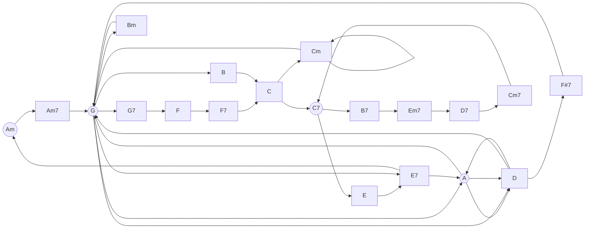

# These are some of my favorite chord progressions

## NOTE:
- Circlular nodes are chords that start songs
- songs must be added in the following format (in the mermaid block):
    - `<artist> - <title>`

### Songlist

- Jack Johnson - Sitting Waiting Wishing
- Ashley Eriksson - Island Song
- Radiohead - Creep
- Sam's Riff 1

---

# TODO
- figure out how to make graph bigger
- Write a utility script for:
    - adding new songs
    - checking for duplicate lines
    - removing songs
    - searching for songs