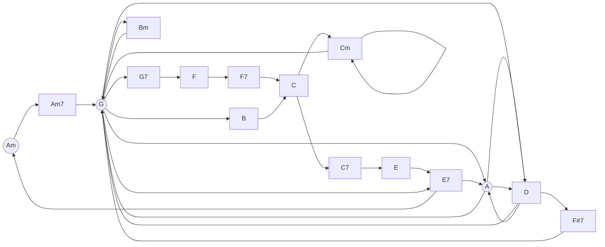

# These are some of my favorite chord progressions

## **Circlular nodes are chords that start songs**

### Songlist

- Jack Johnson - Sitting Waiting Wishing
- Ashley Eriksson - Island Song
- Radiohead - Creep

---

# TODO
## Write a utility script for:
  - adding new songs
  - checking for duplicate lines